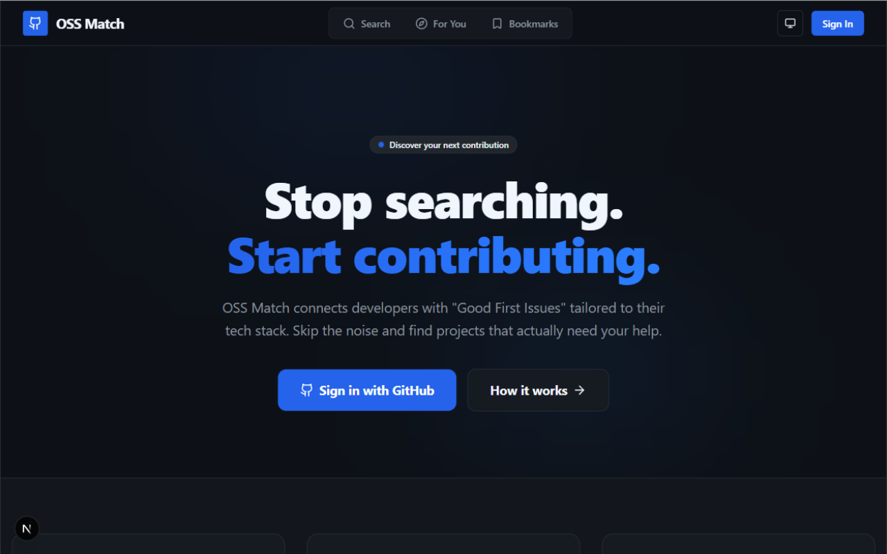

# 🚀 OSS Match | Open-Source Discovery Platform

**OSS Match** is a high-performance system designed to connect developers with impactful open-source opportunities. By orchestrating the GitHub REST API with advanced caching and rate-limiting layers, it provides a seamless discovery experience tailored to a developer's specific skill set.

This project focuses on the "Deploy" and "Scale" pillars of real-world software—utilizing **Docker**, **Redis**, and **type-safe database architecture**.

---

## 🏗 System Architecture & Performance

- **API Orchestration:** Deep integration with the **GitHub REST API** to fetch, aggregate, and filter real-time issue data.
- **Latency Optimization:** Implemented **Upstash Redis** as a caching layer to reduce redundant API calls and drastically improve response times.
- **Traffic Management:** Integrated **Upstash Rate Limiting** to protect system resources and ensure fair usage for unauthenticated users.
- **Containerized Workflow:** Fully architected with **Docker** for consistent environment parity between development and production.

---

## ✨ Key Features

- 🔐 **Secure OAuth Flow:** GitHub-native authentication powered by **NextAuth.js**.
- 🧠 **Intelligent Matching:** Advanced discovery logic filtering by labels (e.g., `good first issue`) and technical stacks.
- ⚡ **Type-Safe Data Layer:** Robust schema management using **Prisma ORM** and **PostgreSQL**.
- 📝 **Validated Interfaces:** Accessible, schema-validated forms built with **React Hook Form** and **Zod**.

---

## 🧰 Tech Stack

| Layer              | Technologies                                   |
| :----------------- | :--------------------------------------------- |
| **Framework**      | Next.js (TypeScript), React                    |
| **Auth**           | NextAuth.js (GitHub OAuth)                     |
| **Database**       | PostgreSQL, Prisma ORM                         |
| **Performance**    | Upstash Redis (Caching), Upstash Rate Limiting |
| **Infrastructure** | Docker, Docker Compose                         |
| **API**            | GitHub REST API                                |

---

## ▶️ Getting Started

### 🐳 The Docker Way (Recommended)

This system is container-ready. Ensure Docker is running, then execute:

```bash
docker compose up --build -d
docker compose exec app npx prisma migrate dev
```

## 🛠 Manual Local Setup

### 1. Clone & Install:

```bash
git clone [https://github.com/mdshakerullahS/oss-match.git](https://github.com/mdshakerullahS/oss-match.git)
cd OSS_Match
npm install
```

### 2. Database Migration:

```bash
npx prisma migrate dev
```

### 3. Run Development Server:

```bash
npm run dev
```

App will be available at: http://localhost:3000

---

## 🔐 Environment Configuration

Create a `.env` file in the root directory and add the following variables:

```bash
# GitHub Authentication
GITHUB_ID=
GITHUB_SECRET=
NEXTAUTH_URL="http://localhost:3000"
NEXTAUTH_SECRET=

# Database Configuration (Local/Cloud)
DATABASE_URL=

# Database Configuration (Docker)
POSTGRES_USER=
POSTGRES_PASSWORD=
POSTGRES_HOST=
POSTGRES_PORT=5432 # Default port
POSTGRES_DB=

# Redis Configuration (Upstash)
REDIS_PROVIDER="upstash"
UPSTASH_REDIS_REST_URL=
UPSTASH_REDIS_REST_TOKEN=

# Redis Configuration (Docker)
REDIS_URL=
```

---

## 📸 Preview



---

## 📄 License

This project is licensed under the **MIT License**.
See the `LICENSE` file for full details.

---

## 🧑‍💻 Developer

**Md Shakerullah Sourov** Full Stack Developer

- LinkedIn: [https://linkedin.com/in/mdshakerullah](https://linkedin.com/in/mdshakerullah)
- Email: [sourovmdshakerullah@gmail.com](mailto:sourovmdshakerullah@gmail.com)

---

## ⭐ Show Your Support

If you like this project, please give it a ⭐ on GitHub!

Happy Coding 🚀
